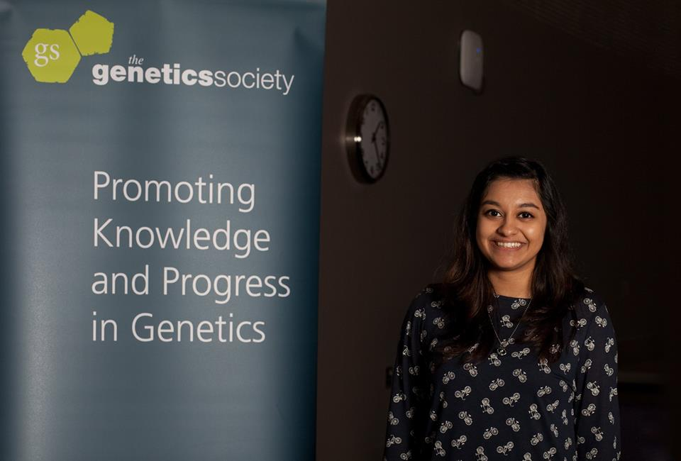
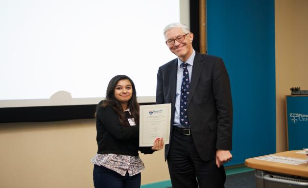

---
title: "Publications + Awards / Acheivements"
date: 2001-01-01
draft: false
# layout options: single, single-sidebar
layout: single
---  

```{r, echo=FALSE, message=FALSE, error=FALSE, warning=FALSE}

library(here)
library(knitr)
library(bookdown)

```


### Awards  

**Virtual Knowledge Exchange Grant 2021** – BC Children’s Hospital Research Institute   
   
**[4 Year Doctoral Fellowship (4YF) Award](https://www.grad.ubc.ca/awards/four-year-doctoral-fellowship-4yf)** (2020-2024) – University of British Columbia  
   
**President's Academic Excellence Initiative PhD Award** (2020-2024) – University of British Columbia   
   
**International Tuition Award (2019-2024)** – University of British Columbia  
   
**[Genes and Development Summer Studentship 2016](https://genetics.org.uk/event/our-workshops/summer-studentships/)** – The Genetics Society UK
  
   
**Faculty of Medical Sciences Undergraduate Research Scholarship 2016** - Newcastle University  
   
**Commendation Award, [Student Research Scholarships and Expeditions Exhibition 2016](https://research.ncl.ac.uk/expeditionresearchscholarships/prizewinners/2016winners/)** – Newcastle University    
   
   

**Second Place Poster Award 2016**, Newcastle University Faculty of Medicine – Newcastle University      
   
**ncl+ Award – Newcastle University** (for extracurricular achievement)   

***  

### Publications  

Martinez, V.D., Cohn D.E., Telkar N, Minatel B.C., Pewarchuk M.E., Marshall, E.A., Price M.E., Robinson W.P., Lam W.L. [Profiling the Small Non-Coding RNA Transcriptome of the Human Placenta.](https://www.nature.com/articles/s41597-021-00948-1).  Sci Data 2021; 8, 166.  

Cohn D.E., Barros-Filho M.C., Minatel B.C., Pewarchuk M.E., Marshall, E.A., Vucic E.A., Sage A.P., Telkar N, Stewart G.L., Jurisica I, Reis P.P., Robinson W.P, Lam W.L. [Reactivation of multiple fetal miRNAs in lung adenocarcinoma](https://www.mdpi.com/2072-6694/13/11/2686/htm). Cancers 2021, 13, 2686.  

Marshall EA, Telkar N, Lam WL. [Functional role of the cancer microbiome in the solid tumour niche](https://doi.org/10.1016/j.crimmu.2021.01.001). Current Research in Immunology 2021; 2: 1–6  

Kuchenbaecker K, Telkar N, Reiker T, et al. [The transferability of lipid loci across African, Asian and European cohorts](https://doi.org/10.1038/s41467-019-12026-7). Nature Communications, 2019; 10: 4330.  

Rees W.D., Telkar N, Lin D, Peloni C, Fathi A, Kobor M, Zachos N, Steiner T. An in vitro chronic damage model impairs inflammatory and regenerative responses in human colonoid monolayers. [Submitted]   

***  
